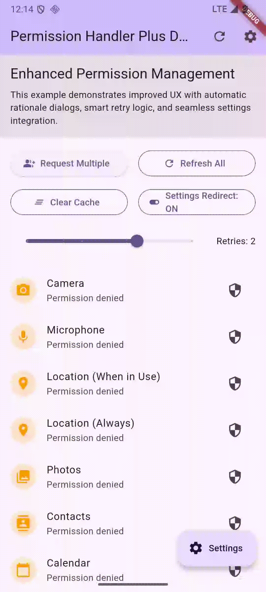

# flutter_permission_handler_plus

[](https://pub.dev/packages/flutter_permission_handler_plus)
[](https://opensource.org/licenses/MIT)

A wrapper around the standard `permission_handler` package that provides built-in rationale dialogs, automatic app settings redirects, automatic retry loops, and clean batch request handling.

<p align="center">
  
</p>

## Features

* **Automatic Rationale Dialogs**: Prompts users with configurable reasons why a permission is needed.
* **Auto Redirect to Settings**: Prompts the user to navigate to system settings if a permission is permanently denied.
* **Robust Batch Requesting**: Requests multiple permissions sequentially to prevent platform locks.
* **Status Cache**: Optional status caching to minimize redundant native platform calls.

## Installation

Add the dependency to your `pubspec.yaml`:

```yaml
dependencies:
  flutter_permission_handler_plus: ^0.1.1
```

Then run:

```bash
flutter pub get
```

## Platform Setup

### Android

Add the required permissions to your `android/app/src/main/AndroidManifest.xml`:

```xml
<uses-permission android:name="android.permission.CAMERA" />
<uses-permission android:name="android.permission.RECORD_AUDIO" />
<uses-permission android:name="android.permission.ACCESS_FINE_LOCATION" />
```

### iOS

Add descriptions for the permissions your app uses in `ios/Runner/Info.plist`:

```xml
<key>NSCameraUsageDescription</key>
<string>This app requires camera access to take photos.</string>
<key>NSMicrophoneUsageDescription</key>
<string>This app requires microphone access to record audio.</string>
```

---

## Usage

### Request a Permission

Request a single permission with default auto-rationale and settings redirect behavior:

```dart
import 'package:flutter_permission_handler_plus/flutter_permission_handler_plus.dart';

final status = await PermissionHandlerPlus.instance.requestPermission(
  PermissionType.camera,
);

if (status.isGranted) {
  // Permission granted
} else if (status.isPermanentlyDenied) {
  // Permanently denied (user rejected and settings redirect is disabled/canceled)
}
```

### Custom Configuration

Configure custom rationale messages, dialog titles, settings redirection, and retry limits:

```dart
final config = PermissionConfig(
  rationale: 'We need camera access to set your profile picture.',
  rationaleTitle: 'Camera Access Required',
  enableAutoRationale: true,
  enableSettingsRedirect: true,
  settingsRedirectMessage: 'Please grant camera access in settings to upload a photo.',
  retryCount: 2,
);

final status = await PermissionHandlerPlus.instance.requestPermission(
  PermissionType.camera,
  config: config,
);
```

### Request Multiple Permissions

Request multiple permissions with specific configurations in a single sequential flow:

```dart
final permissions = {
  PermissionType.camera: PermissionConfig(
    rationale: 'Camera access for scanning QR codes.',
  ),
  PermissionType.locationWhenInUse: PermissionConfig(
    rationale: 'Location access to find nearby stores.',
  ),
};

final results = await PermissionHandlerPlus.instance.requestPermissions(permissions);

results.forEach((permission, status) {
  print('${permission.displayName}: ${status.description}');
});
```

### Check Status Without Prompting

```dart
// Check a single permission status
final status = await PermissionHandlerPlus.instance.checkPermissionStatus(
  PermissionType.camera,
);

// Clear cached statuses if status caching is enabled
PermissionHandlerPlus.instance.clearCache();
```

## License

This project is licensed under the MIT License - see the [LICENSE](LICENSE) file for details.
